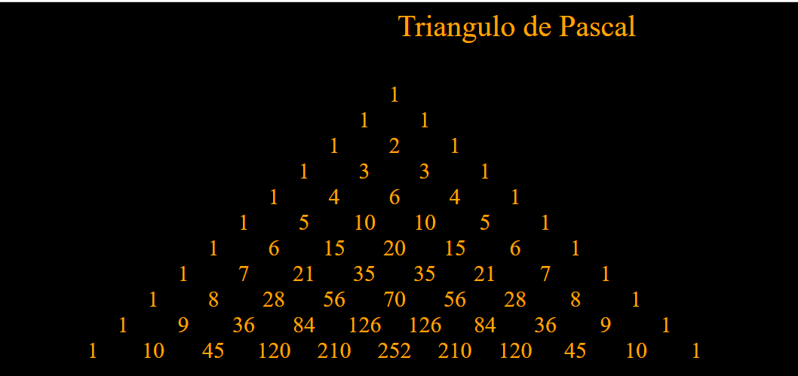

# 3-numbers

## 0-multiplicationTable

### 0-multiplicationTable/v0
~~~
Dame un número:  76
76 * 1 = 76
76 * 2 = 152
76 * 3 = 228
76 * 4 = 304
76 * 5 = 380
76 * 6 = 456
76 * 7 = 532
76 * 8 = 608
76 * 9 = 684
76 * 10 = 760
~~~

## 1-integerDivision

### 1-integerDivision/v0
~~~
Dame el dividendo:  20
Dame el divisor:  5
20 / 5 = 4 y sobran 0
~~~

### 1-integerDivision/v1
~~~
**ESTA MAL*
~~~

## 2-percentage

### 2-percentage/v0
~~~
Dame el tanto por ciento (sin %):  21
21% = 21 · 1 / 100 = 21 · 0,01 = 0.21
Dame la cantidad:  1000
21%  · 1000 = 210
~~~

### 2-percentage/v1
~~~
***NO TIENE FIN***
~~~

## 3-even

### 3-even/v0
~~~
Escribe un número?  23
El numero 23 es impar
~~~

## 4-absoluteValue

### 4-absoluteValue/v0
~~~
Escribe un número?  76
El valor absoluto del número 76 es 76
~~~

## 5-changeCoins

### 5-changeCoins/v0
~~~
Dame la cantidad de céntimos:  123
2 moneda(s) de 50
1 moneda(s) de 20
0 moneda(s) de 10
0 moneda(s) de 5
1 moneda(s) de 2
1 moneda(s) de 1
~~~

### 5-changeCoins/v1
~~~
Dame la cantidad de céntimos:  123
2 moneda(s) de 50
1 moneda(s) de 20
1 moneda(s) de 2 
1 moneda(s) de 1 
~~~

## 6-prime

### 6-prime/v0
~~~
Dame un número positivo:  12
El número 12 no es primo
~~~
### 6-prime/v1
~~~
Dame un número positivo:  12
La suma de los primos en los primeros 12 números es 28
~~~

### 6-prime/v2
~~~
Dame un número positivo:  12
La suma de los primeros 12 primos es 197
~~~

### 6-prime/v3
~~~
Dame un número positivo:  12
U  
PP 
PPP
CC 
CC 
PPPPP
CCC
CCC
PPPPPPP
CCCC
CCCC
CCC
CCC
CCC
CCCCC
CCCCC
PPPPPPPPPPP
CCCCCC
CCCCCC
~~~

* Muestra, desde el 1 hasta la cantidad dada, el siguiente formato:
    * la unidad: 'U'
    * número primo: tantas 'P' como el número
    * número compuesto: tantas filas como su primer divisor de tantas 'C' como el número dividivo por el divisor

## 7-perfect

### 7-perfect/v0
~~~
Dame un número positivo:  28
El número 28 si es perfecto
~~~

~~~
Dame un número positivo:  12
El número 12 no es perfecto
~~~

### 7-perfect/v1
~~~
Dame una posición:  1
El número 6 es el 1º número perfecto
~~~
~~~
Dame una posición:  2
El número 28 es el 2º número perfecto
~~~
~~~
Dame una posición:  3
El número 496 es el 3º número perfecto
~~~
~~~
Dame una posición:  4
El número 8128 es el 4º número perfecto
~~~

## 8-friends

### 8-friends/v0
~~~
Dame un número:  220
Dame otro número:  284
Los números 220 y 284 si son amigos
~~~
~~~
Dame un número:  221
Dame otro número:  283
Los números 221 y 283 si son amigos
~~~

### 8-friends/v1
~~~
Dame un número:  10000
Los números 220 y 284 son amigos
Los números 284 y 220 son amigos
Los números 1184 y 1210 son amigos
Los números 1210 y 1184 son amigos
Los números 2620 y 2924 son amigos
Los números 2924 y 2620 son amigos
Los números 5020 y 5564 son amigos
Los números 5564 y 5020 son amigos
Los números 6232 y 6368 son amigos
Los números 6368 y 6232 son amigos
~~~

## 9-factorial

### 9-factorial/v0
~~~
Dame un número (0-20):  0
El factorial de 0 es 1
~~~
~~~
Dame un número (0-20):  1
El factorial de 1 es 1
~~~
~~~
Dame un número (0-20):  4
El factorial de 4 es 24
~~~
~~~
Dame un número (0-20):  5
El factorial de 5 es 120
~~~
## 10-fibonacci

### 10-fibonacci/v0
~~~
Dame una posición:  2
El término de la serie de Fibonacci de 2 es 1
~~~
## 11-power

### 11-power/v0
~~~
Dame una base:  1
Dame un exponente:  2
La base 1 elevada al exponente 2 es 1
~~~
## 4-trianguloPascal/v0

## 5-expresiones/v0

